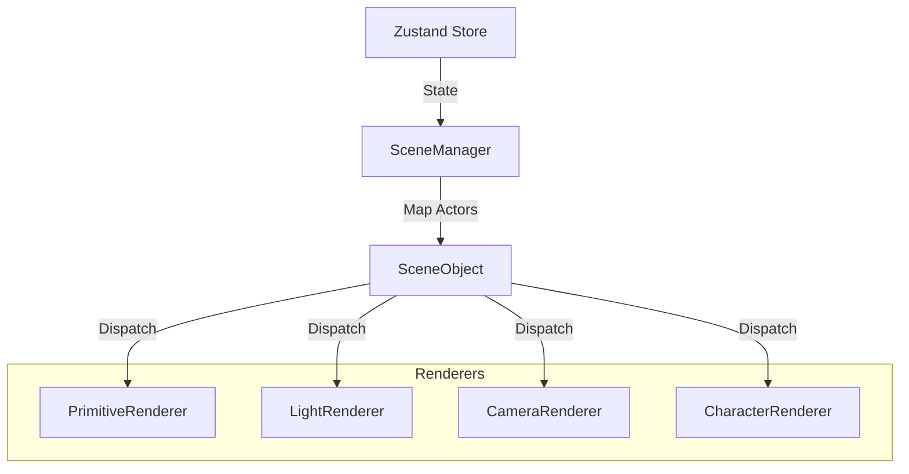
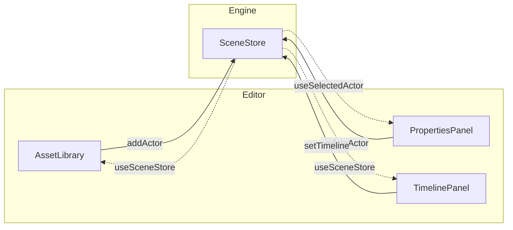
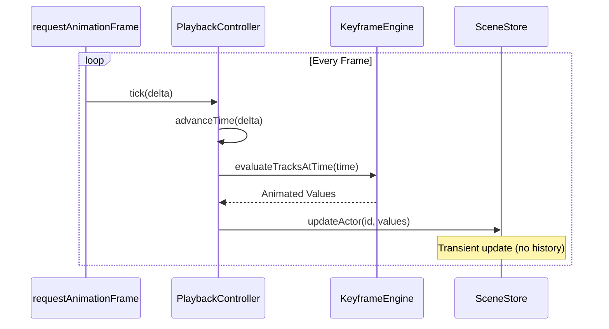

# Architecture

## Overview

Animatica is a **Turborepo monorepo** with 4 packages and 1 app. Each package has strict boundaries and communicates through published interfaces only.

```
Animatica/
├── package.json              # Root workspace config
├── turbo.json                # Build pipeline
├── tsconfig.base.json        # Shared TS config
│
├── packages/
│   ├── engine/               # 🎮 Animation engine (Three.js)
│   ├── editor/               # 🖥️ Editor UI (React components)
│   ├── platform/             # 🌐 Social platform (feeds, profiles, video)
│   └── contracts/            # 💰 Solidity smart contracts
│
├── apps/
│   └── web/                  # Next.js app (combines all packages)
│
└── docs/                     # Documentation
```

---

## Tech Stack

| Layer | Technology | Rationale |
|-------|-----------|-----------|
| **Runtime** | Node.js 20+ | LTS, stable |
| **Framework** | Next.js 15 (App Router) | SSR, API routes, edge functions |
| **UI** | React 19 + TypeScript 5.9 | Strict mode, concurrent features |
| **3D Engine** | Three.js 0.182 + React Three Fiber 9 | Mature, huge ecosystem |
| **State** | Zustand 5 + Immer | Immutable, sliced, testable |
| **Validation** | Zod 4 | Runtime type safety for JSON |
| **Styling** | Tailwind CSS v4 | Utility-first, consistent |
| **Build** | Vite 7 + Turborepo | Fast builds, monorepo caching |
| **Testing** | Vitest 4 | Fast, Vite-native |
| **Collab** | Yjs + y-websocket | CRDT-based real-time sync |
| **Auth** | NextAuth.js 5 | Email + OAuth + wallet |
| **Database** | PostgreSQL (Supabase) | Managed, real-time subscriptions |
| **Storage** | Cloudflare R2 | S3-compatible, no egress fees |
| **CDN/Video** | Cloudflare Stream or Mux | Adaptive bitrate, global CDN |
| **Hosting** | Vercel | Next.js-native, edge functions |
| **CI/CD** | GitHub Actions | PR checks, deploy previews |

---

## Package Details

### `@Animatica/engine`

The core animation engine. **No UI components** — only 3D/2D rendering, animation logic, and data structures.

```
packages/engine/src/
├── index.ts                    # Public API (re-exports)
├── types/
│   └── index.ts                # All TypeScript interfaces
├── schemas/                    # Zod validation schemas
│   ├── index.ts
│   ├── actor.schema.ts
│   └── scene.schema.ts
├── store/
│   └── sceneStore.ts           # Main Zustand store (Immer + Persist + Zundo)
├── scene/
│   ├── SceneManager.tsx        # Root scene graph
│   ├── SceneObject.tsx         # Actor → renderer dispatcher
│   └── renderers/
│       ├── PrimitiveRenderer.tsx
│       ├── CharacterRenderer.tsx
│       ├── LightRenderer.tsx
│       └── CameraRenderer.tsx
├── animation/
│   ├── interpolate.ts          # Interpolation logic
│   └── easing.ts               # Easing functions
├── playback/
│   └── PlaybackController.ts   # requestAnimationFrame loop
├── ai/
│   └── promptTemplates.ts      # Static prompt for LLM
├── config/
│   └── featureFlags.ts         # Feature flag system
└── importer/
    └── scriptImporter.ts       # JSON → project state
```

**Public API:**

```typescript
// Components (for R3F Canvas)
export { PrimitiveRenderer } from './scene/renderers/PrimitiveRenderer'
export { LightRenderer } from './scene/renderers/LightRenderer'
export { CameraRenderer } from './scene/renderers/CameraRenderer'
export { CharacterRenderer } from './scene/renderers/CharacterRenderer'
export { SceneManager } from './scene/SceneManager'

// Hooks
export { usePlayback } from './playback/PlaybackController'
export { useSceneStore, getActorById, getActiveActors, getCurrentTime } from './store/sceneStore';
export { useFeatureFlag, FeatureFlagProvider } from './config/featureFlags';

// Utils
export { importScript, validateScript, tryImportScript } from './importer/scriptImporter'
export { getAiPrompt, PROMPT_STYLES } from './ai/promptTemplates'

// Animation
export * as Easing from './animation/easing';
export { interpolateKeyframes, evaluateTracksAtTime } from './animation/interpolate';

// Schemas
export * from './schemas/index'

// Types
export * from './types/index'
```

### `@Animatica/editor`

UI panels and modals. **Only imports from `@Animatica/engine` public API.** No direct Three.js usage.

```
packages/editor/src/
├── index.ts
├── layouts/
│   └── EditorLayout.tsx          # 3-panel layout shell
├── panels/
│   ├── AssetLibrary.tsx          # Left: add actors/props
│   ├── PropertiesPanel.tsx       # Right: transform, materials
│   ├── TimelinePanel.tsx         # Bottom: keyframes + tracks
├── modals/
│   ├── ScriptConsole.tsx         # JSON import + AI prompt
│   ├── ExportModal.tsx           # Export settings
├── components/
│   ├── Toast.tsx                 # Toast notifications
│   └── ToastContext.tsx          # Context provider
└── hooks/
    └── useKeyboardShortcuts.ts   # Hotkey manager
```

**Public API:**

```typescript
// Layouts
export { EditorLayout } from './layouts/EditorLayout';

// Panels
export { AssetLibrary } from './panels/AssetLibrary';
export { PropertiesPanel } from './panels/PropertiesPanel';
export { TimelinePanel } from './panels/TimelinePanel';

// Modals
export { ScriptConsole } from './modals/ScriptConsole';
export { ExportModal } from './modals/ExportModal';
```

### `@Animatica/platform`

Social platform — **standalone package** with its own API layer. Does NOT import engine.

```
packages/platform/src/
├── pages/
│   ├── Feed.tsx                  # Discovery feed
│   ├── Profile.tsx               # Creator profile
│   ├── Watch.tsx                 # Video player page
│   ├── Series.tsx                # Series/episode viewer
│   └── Marketplace.tsx           # Asset marketplace
├── components/
│   ├── VideoCard.tsx
│   ├── DonateButton.tsx
│   ├── CreatorBadge.tsx
│   ├── CommentThread.tsx
│   ├── AssetCard.tsx
│   └── EarningsDashboard.tsx
└── api/
    ├── videos.ts                 # Video CRUD
    ├── users.ts                  # User/profile API
    ├── donations.ts              # Donation API
    ├── marketplace.ts            # Asset marketplace API
    └── analytics.ts              # Views, retention, etc.
```

### `@Animatica/contracts`

Solidity smart contracts with Hardhat.

```
packages/contracts/
├── contracts/
│   ├── DonationPool.sol          # 70/20/10 split
│   ├── CreatorFund.sol           # Weight-based distribution
│   ├── AnimaticaTreasury.sol       # Platform treasury
│   ├── AssetMarketplace.sol      # Buy/sell/rent assets
│   └── FilmRegistry.sol          # On-chain film metadata
├── test/
│   ├── DonationPool.test.ts
│   ├── CreatorFund.test.ts
│   └── AssetMarketplace.test.ts
├── scripts/
│   └── deploy.ts
└── hardhat.config.ts
```

---

## Component Diagrams

### Engine Data Flow

The Engine uses a strict unidirectional data flow where the Store is the single source of truth.



### Editor-Engine Relationship

Editor panels read state from the Store and dispatch actions to update it. They do not communicate directly with the Canvas or Renderers.



### Playback Loop

The playback system runs on `requestAnimationFrame` via `useFrame` to ensure smooth animation independent of React render cycles.



---

## Dependency Graph

```
@Animatica/contracts  (standalone — no JS dependencies)
        ↑
        │ (ABI imports only)
        │
@Animatica/engine  ←── @Animatica/editor
        ↑                    ↑
        │                    │
        └────── apps/web ────┘
                    ↑
                    │
            @Animatica/platform
```

**Rules:**

- `engine` imports NOTHING from other packages
- `editor` imports ONLY from `engine`
- `platform` imports NOTHING from engine/editor (communicates via API)
- `apps/web` imports from all packages to compose the full app
- `contracts` is standalone (Solidity + Hardhat)

---

## Configuration

### TypeScript (strict)

```json
{
  "compilerOptions": {
    "strict": true,
    "noImplicitAny": true,
    "noUnusedLocals": true,
    "noUnusedParameters": true,
    "noFallthroughCasesInSwitch": true,
    "forceConsistentCasingInFileNames": true,
    "isolatedModules": true,
    "esModuleInterop": true,
    "skipLibCheck": true,
    "resolveJsonModule": true,
    "jsx": "react-jsx",
    "target": "ES2022",
    "module": "ESNext",
    "moduleResolution": "bundler",
    "declaration": true,
    "declarationMap": true,
    "sourceMap": true
  }
}
```

### ESLint Rules

- `no-explicit-any`: error
- `no-unused-vars`: error
- `react-hooks/exhaustive-deps`: warn
- `@typescript-eslint/strict-boolean-expressions`: error
- Max file length: 200 LOC (warning at 150)
- Named exports only (no `export default`)
