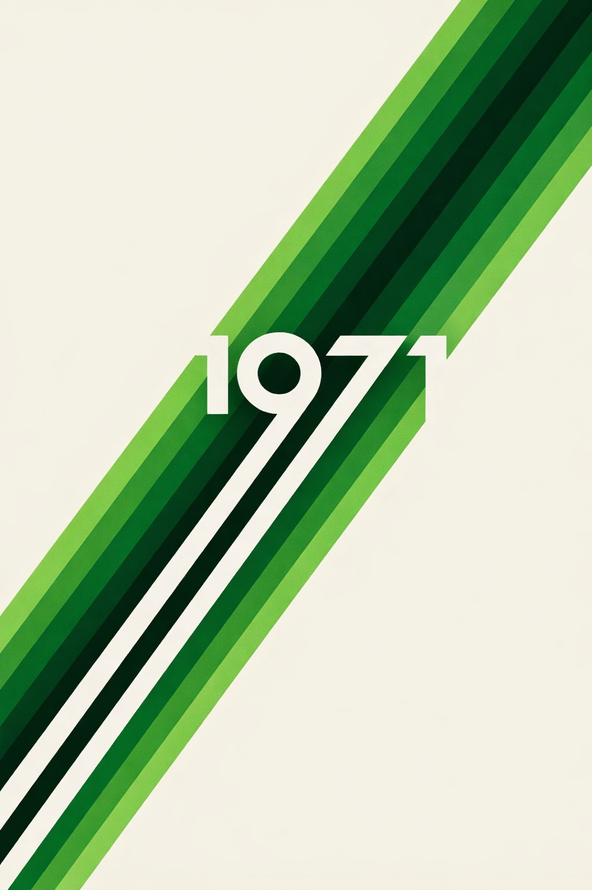

# Branding — Animatica

> **Design Philosophy:** "Retro Futurism 71" — 1970s parallel-stripe aesthetics in a modern dark interface. **Green + White + Black** only.

---

## Visual Identity

### Reference

Our visual language draws from 1970s graphic design — specifically the iconic parallel stripe motifs and bold geometric typography of that era. The key reference is a 1971-style poster with green gradient stripes on cream, reinterpreted for a dark, modern interface.



### Core Principles

1. **Monochromatic Green** — Green is the only accent color. From dark forest (#0A5C36) to bright lime (#4ADE80)
2. **Retro Stripe Motif** — Parallel stripes in 5 green shades are our signature. Used in dividers, loading bars, and decorative elements
3. **Dark Canvas** — Rich black backgrounds (#0A0A0A) make the green pop
4. **Geometric Typography** — Space Grotesk for headers gives that 70s futuristic feel
5. **Generous Rounding** — 16px radius on panels, 12px on buttons. Soft but precise

---

## 🎨 Color Palette

### Green Spectrum

| Token | Hex | Usage |
|-------|-----|-------|
| `green-950` | `#052E1A` | Deepest backgrounds |
| `green-900` | `#0A5C36` | Dark accents, stripe |
| `green-800` | `#0D7A48` | Medium stripe |
| `green-700` | `#15803D` | Active states |
| `green-600` | `#16A34A` | **⬤ PRIMARY** — buttons, links, selection |
| `green-500` | `#22C55E` | Hover states |
| `green-400` | `#4ADE80` | Bright stripe, success |
| `green-300` | `#86EFAC` | Glow effects |
| `green-200` | `#BBF7D0` | Pale highlights |

### Neutrals

| Token | Hex | Usage |
|-------|-----|-------|
| `bg-deep` | `#0A0A0A` | Root background |
| `bg-surface` | `#1A1A1A` | Panels, cards |
| `bg-elevated` | `#222222` | Hover, modals |
| `text-primary` | `#F5F5F0` | Main text (warm white) |
| `text-secondary` | `#A3A3A3` | Muted text |
| `text-muted` | `#737373` | Disabled |

### The One Exception

| Token | Hex | Usage |
|-------|-----|-------|
| `error` | `#EF4444` | Error states only |

---

## ✏️ Typography

| Role | Font | Weight |
|------|------|--------|
| Headlines | **Space Grotesk** | 600-700 |
| Body | **Inter** | 400-500 |
| Code/JSON | **JetBrains Mono** | 400 |

---

## 🌀 Retro 71 Stripe

Our signature element — 5 parallel green stripes from dark to light.

```
████  #0A5C36  (Dark Forest)
████  #0D7A48  (Forest)
████  #16A34A  (Primary Green)
████  #22C55E  (Bright Green)
████  #4ADE80  (Lime)
```

### Where to Use

- ✅ Section dividers (thin horizontal stripe)
- ✅ Loading/progress indicators
- ✅ Active sidebar item left-border
- ✅ Empty state decorations
- ✅ Header accent under logo
- ❌ Never as full background fill
- ❌ Never in text

---

## 💬 Tone of Voice

| Tagline | Vibe |
|---------|------|
| **"Your story, animated"** | Clean, empowering |
| **"Cinema for everyone"** | Democratic |
| **"Imagine. Animate. Earn."** | Action-oriented |

---

## Logo Direction

- **Font:** Space Grotesk Bold, all lowercase "animatica"
- **Mark:** Abstract play button or film frame in green
- **Accent:** Retro stripe underneath the wordmark
- **Favicon:** Green "A" on black, 16px

---

## Implementation

- **Design tokens:** See [DESIGN_TOKENS.md](DESIGN_TOKENS.md)
- **CSS variables:** `packages/editor/src/styles/design-tokens.css`
