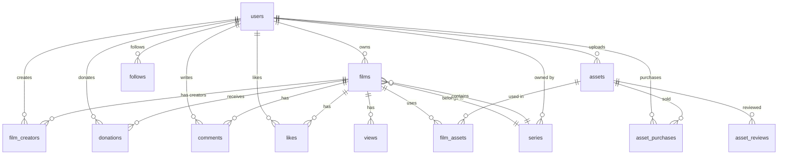

# Supabase Database Design

## Overview

Animatica uses **Supabase** (managed PostgreSQL) as its primary database with:

- Row Level Security (RLS) on all tables
- Real-time subscriptions for collaboration  
- Edge Functions for server-side logic
- Storage buckets for assets and videos

---

## Schema Diagram



---

## Tables

### `profiles` (extends Supabase auth.users)

```sql
CREATE TABLE public.profiles (
  id UUID PRIMARY KEY REFERENCES auth.users(id) ON DELETE CASCADE,
  display_name TEXT NOT NULL,
  username TEXT UNIQUE NOT NULL,
  avatar_url TEXT,
  bio TEXT DEFAULT '',
  website TEXT,
  
  -- Crypto
  wallet_address TEXT UNIQUE,
  
  -- Stats (denormalized for performance)
  total_films INTEGER DEFAULT 0,
  total_views BIGINT DEFAULT 0,
  total_earned_wei TEXT DEFAULT '0',
  follower_count INTEGER DEFAULT 0,
  following_count INTEGER DEFAULT 0,
  
  -- Creator Fund
  creator_weight INTEGER DEFAULT 0,
  
  -- Preferences
  preferred_language TEXT DEFAULT 'en',
  preferred_role TEXT DEFAULT 'director',
  
  created_at TIMESTAMPTZ DEFAULT NOW(),
  updated_at TIMESTAMPTZ DEFAULT NOW()
);

-- Index for username lookup
CREATE UNIQUE INDEX idx_profiles_username ON profiles(username);
CREATE INDEX idx_profiles_wallet ON profiles(wallet_address) WHERE wallet_address IS NOT NULL;

-- Auto-create profile on signup
CREATE OR REPLACE FUNCTION public.handle_new_user()
RETURNS TRIGGER AS $$
BEGIN
  INSERT INTO public.profiles (id, display_name, username, avatar_url)
  VALUES (
    NEW.id,
    COALESCE(NEW.raw_user_meta_data->>'display_name', 'Creator'),
    COALESCE(NEW.raw_user_meta_data->>'username', 'user_' || LEFT(NEW.id::text, 8)),
    NEW.raw_user_meta_data->>'avatar_url'
  );
  RETURN NEW;
END;
$$ LANGUAGE plpgsql SECURITY DEFINER;

CREATE TRIGGER on_auth_user_created
  AFTER INSERT ON auth.users
  FOR EACH ROW EXECUTE FUNCTION public.handle_new_user();
```

### `films`

```sql
CREATE TYPE film_visibility AS ENUM ('public', 'unlisted', 'private', 'draft');
CREATE TYPE content_rating AS ENUM ('G', 'PG', 'T', 'M');

CREATE TABLE public.films (
  id UUID PRIMARY KEY DEFAULT gen_random_uuid(),
  owner_id UUID NOT NULL REFERENCES profiles(id) ON DELETE CASCADE,
  
  -- Content
  title TEXT NOT NULL,
  description TEXT DEFAULT '',
  slug TEXT UNIQUE NOT NULL,
  thumbnail_url TEXT,
  video_url TEXT,
  project_json JSONB,
  
  -- Metadata
  duration_seconds INTEGER DEFAULT 0,
  rating content_rating DEFAULT 'G',
  visibility film_visibility DEFAULT 'draft',
  tags TEXT[] DEFAULT '{}',
  genre TEXT,
  language TEXT DEFAULT 'en',
  
  -- Series
  series_id UUID REFERENCES series(id) ON DELETE SET NULL,
  episode_number INTEGER,
  season_number INTEGER DEFAULT 1,
  
  -- Stats (denormalized)
  view_count BIGINT DEFAULT 0,
  like_count INTEGER DEFAULT 0,
  comment_count INTEGER DEFAULT 0,
  donation_total_wei TEXT DEFAULT '0',
  avg_retention_pct DECIMAL(5,2) DEFAULT 0,
  
  -- Chain
  chain_film_id BIGINT UNIQUE,  -- On-chain film ID for smart contracts
  
  -- Timestamps
  published_at TIMESTAMPTZ,
  created_at TIMESTAMPTZ DEFAULT NOW(),
  updated_at TIMESTAMPTZ DEFAULT NOW()
);

-- Indexes
CREATE INDEX idx_films_owner ON films(owner_id);
CREATE INDEX idx_films_series ON films(series_id);
CREATE INDEX idx_films_visibility ON films(visibility) WHERE visibility = 'public';
CREATE INDEX idx_films_published ON films(published_at DESC) WHERE visibility = 'public';
CREATE INDEX idx_films_genre ON films(genre) WHERE visibility = 'public';
CREATE INDEX idx_films_tags ON films USING GIN(tags);

-- Full-text search
ALTER TABLE films ADD COLUMN fts tsvector
  GENERATED ALWAYS AS (
    setweight(to_tsvector('english', COALESCE(title, '')), 'A') ||
    setweight(to_tsvector('english', COALESCE(description, '')), 'B')
  ) STORED;
CREATE INDEX idx_films_fts ON films USING GIN(fts);

-- Auto-generate slug
CREATE OR REPLACE FUNCTION generate_film_slug()
RETURNS TRIGGER AS $$
BEGIN
  IF NEW.slug IS NULL OR NEW.slug = '' THEN
    NEW.slug := LOWER(REGEXP_REPLACE(NEW.title, '[^a-zA-Z0-9]+', '-', 'g')) 
                || '-' || LEFT(NEW.id::text, 8);
  END IF;
  RETURN NEW;
END;
$$ LANGUAGE plpgsql;

CREATE TRIGGER film_slug_trigger
  BEFORE INSERT ON films
  FOR EACH ROW EXECUTE FUNCTION generate_film_slug();

-- Auto-update updated_at
CREATE OR REPLACE FUNCTION update_timestamp()
RETURNS TRIGGER AS $$
BEGIN
  NEW.updated_at = NOW();
  RETURN NEW;
END;
$$ LANGUAGE plpgsql;

CREATE TRIGGER films_updated_at
  BEFORE UPDATE ON films
  FOR EACH ROW EXECUTE FUNCTION update_timestamp();
```

### `film_creators`

```sql
CREATE TYPE creator_role AS ENUM (
  'director', 'writer', 'animator', 'producer', 
  'sound_designer', 'asset_creator', 'voice_actor'
);

CREATE TABLE public.film_creators (
  film_id UUID REFERENCES films(id) ON DELETE CASCADE,
  user_id UUID REFERENCES profiles(id) ON DELETE CASCADE,
  role creator_role NOT NULL,
  revenue_share_bps INTEGER NOT NULL DEFAULT 10000,  -- basis points (10000 = 100%)
  invited_at TIMESTAMPTZ DEFAULT NOW(),
  accepted_at TIMESTAMPTZ,
  
  PRIMARY KEY (film_id, user_id, role),
  CONSTRAINT valid_share CHECK (revenue_share_bps >= 0 AND revenue_share_bps <= 10000)
);

CREATE INDEX idx_film_creators_user ON film_creators(user_id);
```

### `series`

```sql
CREATE TABLE public.series (
  id UUID PRIMARY KEY DEFAULT gen_random_uuid(),
  owner_id UUID NOT NULL REFERENCES profiles(id) ON DELETE CASCADE,
  title TEXT NOT NULL,
  description TEXT DEFAULT '',
  thumbnail_url TEXT,
  slug TEXT UNIQUE NOT NULL,
  genre TEXT,
  tags TEXT[] DEFAULT '{}',
  
  -- Stats
  episode_count INTEGER DEFAULT 0,
  subscriber_count INTEGER DEFAULT 0,
  
  created_at TIMESTAMPTZ DEFAULT NOW(),
  updated_at TIMESTAMPTZ DEFAULT NOW()
);

CREATE INDEX idx_series_owner ON series(owner_id);
```

### `views`

```sql
CREATE TABLE public.views (
  id UUID PRIMARY KEY DEFAULT gen_random_uuid(),
  film_id UUID NOT NULL REFERENCES films(id) ON DELETE CASCADE,
  user_id UUID REFERENCES profiles(id) ON DELETE SET NULL,
  
  -- Session
  session_id TEXT NOT NULL,
  watched_seconds INTEGER DEFAULT 0,
  total_seconds INTEGER NOT NULL,
  retention_pct DECIMAL(5,2) GENERATED ALWAYS AS (
    CASE WHEN total_seconds > 0 
    THEN LEAST((watched_seconds::decimal / total_seconds) * 100, 100)
    ELSE 0 END
  ) STORED,
  
  -- Context
  source TEXT,  -- 'feed', 'search', 'direct', 'embed'
  device TEXT,  -- 'desktop', 'mobile', 'tablet'
  country TEXT,
  
  created_at TIMESTAMPTZ DEFAULT NOW()
);

CREATE INDEX idx_views_film ON views(film_id);
CREATE INDEX idx_views_user ON views(user_id) WHERE user_id IS NOT NULL;
CREATE INDEX idx_views_created ON views(created_at DESC);

-- Update film view_count + avg retention on insert
CREATE OR REPLACE FUNCTION update_film_view_stats()
RETURNS TRIGGER AS $$
BEGIN
  UPDATE films SET 
    view_count = view_count + 1,
    avg_retention_pct = (
      SELECT AVG(retention_pct) FROM views WHERE film_id = NEW.film_id
    )
  WHERE id = NEW.film_id;
  
  -- Also update creator profile total_views
  UPDATE profiles SET total_views = total_views + 1
  WHERE id = (SELECT owner_id FROM films WHERE id = NEW.film_id);
  
  RETURN NEW;
END;
$$ LANGUAGE plpgsql SECURITY DEFINER;

CREATE TRIGGER on_view_created
  AFTER INSERT ON views
  FOR EACH ROW EXECUTE FUNCTION update_film_view_stats();
```

### `donations`

```sql
CREATE TABLE public.donations (
  id UUID PRIMARY KEY DEFAULT gen_random_uuid(),
  donor_id UUID REFERENCES profiles(id) ON DELETE SET NULL,
  film_id UUID NOT NULL REFERENCES films(id) ON DELETE CASCADE,
  
  -- Amount
  amount_wei TEXT NOT NULL,
  amount_usd DECIMAL(12,2),  -- Cached USD value at time of donation
  currency TEXT DEFAULT 'ETH',
  
  -- Chain
  tx_hash TEXT UNIQUE NOT NULL,
  chain TEXT DEFAULT 'base',
  block_number BIGINT,
  
  -- Split record
  creator_amount_wei TEXT NOT NULL,
  fund_amount_wei TEXT NOT NULL,
  platform_amount_wei TEXT NOT NULL,
  
  -- Fiat (if paid via Stripe)
  stripe_payment_id TEXT UNIQUE,
  is_fiat BOOLEAN DEFAULT FALSE,
  
  created_at TIMESTAMPTZ DEFAULT NOW()
);

CREATE INDEX idx_donations_film ON donations(film_id);
CREATE INDEX idx_donations_donor ON donations(donor_id);
CREATE INDEX idx_donations_created ON donations(created_at DESC);

-- Update film donation total on insert
CREATE OR REPLACE FUNCTION update_film_donation_stats()
RETURNS TRIGGER AS $$
BEGIN
  UPDATE films SET 
    donation_total_wei = (
      SELECT COALESCE(SUM(amount_wei::numeric), 0)::text 
      FROM donations WHERE film_id = NEW.film_id
    )
  WHERE id = NEW.film_id;
  RETURN NEW;
END;
$$ LANGUAGE plpgsql SECURITY DEFINER;

CREATE TRIGGER on_donation_created
  AFTER INSERT ON donations
  FOR EACH ROW EXECUTE FUNCTION update_film_donation_stats();
```

### `comments`

```sql
CREATE TABLE public.comments (
  id UUID PRIMARY KEY DEFAULT gen_random_uuid(),
  film_id UUID NOT NULL REFERENCES films(id) ON DELETE CASCADE,
  user_id UUID NOT NULL REFERENCES profiles(id) ON DELETE CASCADE,
  parent_id UUID REFERENCES comments(id) ON DELETE CASCADE,
  
  body TEXT NOT NULL,
  
  -- Moderation
  is_edited BOOLEAN DEFAULT FALSE,
  is_hidden BOOLEAN DEFAULT FALSE,
  
  -- Stats
  like_count INTEGER DEFAULT 0,
  reply_count INTEGER DEFAULT 0,
  
  created_at TIMESTAMPTZ DEFAULT NOW(),
  updated_at TIMESTAMPTZ DEFAULT NOW()
);

CREATE INDEX idx_comments_film ON comments(film_id);
CREATE INDEX idx_comments_parent ON comments(parent_id) WHERE parent_id IS NOT NULL;
CREATE INDEX idx_comments_user ON comments(user_id);

-- Update film comment_count
CREATE OR REPLACE FUNCTION update_film_comment_count()
RETURNS TRIGGER AS $$
BEGIN
  IF TG_OP = 'INSERT' THEN
    UPDATE films SET comment_count = comment_count + 1 WHERE id = NEW.film_id;
    IF NEW.parent_id IS NOT NULL THEN
      UPDATE comments SET reply_count = reply_count + 1 WHERE id = NEW.parent_id;
    END IF;
  ELSIF TG_OP = 'DELETE' THEN
    UPDATE films SET comment_count = GREATEST(comment_count - 1, 0) WHERE id = OLD.film_id;
    IF OLD.parent_id IS NOT NULL THEN
      UPDATE comments SET reply_count = GREATEST(reply_count - 1, 0) WHERE id = OLD.parent_id;
    END IF;
  END IF;
  RETURN COALESCE(NEW, OLD);
END;
$$ LANGUAGE plpgsql SECURITY DEFINER;

CREATE TRIGGER on_comment_change
  AFTER INSERT OR DELETE ON comments
  FOR EACH ROW EXECUTE FUNCTION update_film_comment_count();
```

### `likes`

```sql
CREATE TABLE public.likes (
  film_id UUID REFERENCES films(id) ON DELETE CASCADE,
  user_id UUID REFERENCES profiles(id) ON DELETE CASCADE,
  created_at TIMESTAMPTZ DEFAULT NOW(),
  PRIMARY KEY (film_id, user_id)
);

CREATE INDEX idx_likes_user ON likes(user_id);

-- Update film like_count
CREATE OR REPLACE FUNCTION update_film_like_count()
RETURNS TRIGGER AS $$
BEGIN
  IF TG_OP = 'INSERT' THEN
    UPDATE films SET like_count = like_count + 1 WHERE id = NEW.film_id;
  ELSIF TG_OP = 'DELETE' THEN
    UPDATE films SET like_count = GREATEST(like_count - 1, 0) WHERE id = OLD.film_id;
  END IF;
  RETURN COALESCE(NEW, OLD);
END;
$$ LANGUAGE plpgsql SECURITY DEFINER;

CREATE TRIGGER on_like_change
  AFTER INSERT OR DELETE ON likes
  FOR EACH ROW EXECUTE FUNCTION update_film_like_count();
```

### `follows`

```sql
CREATE TABLE public.follows (
  follower_id UUID REFERENCES profiles(id) ON DELETE CASCADE,
  following_id UUID REFERENCES profiles(id) ON DELETE CASCADE,
  created_at TIMESTAMPTZ DEFAULT NOW(),
  PRIMARY KEY (follower_id, following_id),
  CONSTRAINT no_self_follow CHECK (follower_id != following_id)
);

CREATE INDEX idx_follows_following ON follows(following_id);

-- Update follower/following counts
CREATE OR REPLACE FUNCTION update_follow_counts()
RETURNS TRIGGER AS $$
BEGIN
  IF TG_OP = 'INSERT' THEN
    UPDATE profiles SET follower_count = follower_count + 1 WHERE id = NEW.following_id;
    UPDATE profiles SET following_count = following_count + 1 WHERE id = NEW.follower_id;
  ELSIF TG_OP = 'DELETE' THEN
    UPDATE profiles SET follower_count = GREATEST(follower_count - 1, 0) WHERE id = OLD.following_id;
    UPDATE profiles SET following_count = GREATEST(following_count - 1, 0) WHERE id = OLD.follower_id;
  END IF;
  RETURN COALESCE(NEW, OLD);
END;
$$ LANGUAGE plpgsql SECURITY DEFINER;

CREATE TRIGGER on_follow_change
  AFTER INSERT OR DELETE ON follows
  FOR EACH ROW EXECUTE FUNCTION update_follow_counts();
```

### `assets` (Marketplace)

```sql
CREATE TYPE asset_category AS ENUM (
  'character', 'prop', 'environment', 'sprite',
  'animation_clip', 'sound_pack', 'template'
);

CREATE TYPE asset_pricing AS ENUM ('free', 'purchase', 'rental', 'royalty');

CREATE TABLE public.assets (
  id UUID PRIMARY KEY DEFAULT gen_random_uuid(),
  creator_id UUID NOT NULL REFERENCES profiles(id) ON DELETE CASCADE,
  
  -- Content
  name TEXT NOT NULL,
  description TEXT DEFAULT '',
  category asset_category NOT NULL,
  tags TEXT[] DEFAULT '{}',
  
  -- Files
  file_url TEXT NOT NULL,
  preview_url TEXT,
  thumbnail_url TEXT,
  file_size_bytes BIGINT,
  polygon_count INTEGER,
  file_format TEXT,  -- 'glb', 'fbx', 'png', 'svg', 'json', 'mp3'
  
  -- Pricing
  pricing_model asset_pricing DEFAULT 'free',
  price_cents INTEGER DEFAULT 0,
  royalty_bps INTEGER DEFAULT 0,  -- basis points for royalty model
  
  -- Stats
  download_count INTEGER DEFAULT 0,
  usage_count INTEGER DEFAULT 0,  -- films using this asset
  rating_avg DECIMAL(3,2) DEFAULT 0,
  rating_count INTEGER DEFAULT 0,
  revenue_total_wei TEXT DEFAULT '0',
  
  -- Moderation
  is_approved BOOLEAN DEFAULT FALSE,
  is_active BOOLEAN DEFAULT TRUE,
  
  -- Chain
  chain_asset_id BIGINT UNIQUE,
  
  -- Search
  fts tsvector GENERATED ALWAYS AS (
    setweight(to_tsvector('english', COALESCE(name, '')), 'A') ||
    setweight(to_tsvector('english', COALESCE(description, '')), 'B')
  ) STORED,
  
  created_at TIMESTAMPTZ DEFAULT NOW(),
  updated_at TIMESTAMPTZ DEFAULT NOW()
);

CREATE INDEX idx_assets_creator ON assets(creator_id);
CREATE INDEX idx_assets_category ON assets(category);
CREATE INDEX idx_assets_pricing ON assets(pricing_model);
CREATE INDEX idx_assets_fts ON assets USING GIN(fts);
CREATE INDEX idx_assets_tags ON assets USING GIN(tags);
```

### `asset_purchases`

```sql
CREATE TABLE public.asset_purchases (
  id UUID PRIMARY KEY DEFAULT gen_random_uuid(),
  asset_id UUID NOT NULL REFERENCES assets(id) ON DELETE CASCADE,
  buyer_id UUID NOT NULL REFERENCES profiles(id) ON DELETE CASCADE,
  
  price_paid_cents INTEGER NOT NULL,
  tx_hash TEXT,
  
  -- Rental
  rental_expires_at TIMESTAMPTZ,
  
  created_at TIMESTAMPTZ DEFAULT NOW(),
  UNIQUE(asset_id, buyer_id)
);

CREATE INDEX idx_asset_purchases_buyer ON asset_purchases(buyer_id);
```

### `asset_reviews`

```sql
CREATE TABLE public.asset_reviews (
  id UUID PRIMARY KEY DEFAULT gen_random_uuid(),
  asset_id UUID NOT NULL REFERENCES assets(id) ON DELETE CASCADE,
  user_id UUID NOT NULL REFERENCES profiles(id) ON DELETE CASCADE,
  
  rating INTEGER NOT NULL CHECK (rating >= 1 AND rating <= 5),
  body TEXT DEFAULT '',
  
  created_at TIMESTAMPTZ DEFAULT NOW(),
  UNIQUE(asset_id, user_id)
);

-- Update asset rating on review change
CREATE OR REPLACE FUNCTION update_asset_rating()
RETURNS TRIGGER AS $$
BEGIN
  UPDATE assets SET
    rating_avg = (SELECT AVG(rating) FROM asset_reviews WHERE asset_id = COALESCE(NEW.asset_id, OLD.asset_id)),
    rating_count = (SELECT COUNT(*) FROM asset_reviews WHERE asset_id = COALESCE(NEW.asset_id, OLD.asset_id))
  WHERE id = COALESCE(NEW.asset_id, OLD.asset_id);
  RETURN COALESCE(NEW, OLD);
END;
$$ LANGUAGE plpgsql SECURITY DEFINER;

CREATE TRIGGER on_review_change
  AFTER INSERT OR UPDATE OR DELETE ON asset_reviews
  FOR EACH ROW EXECUTE FUNCTION update_asset_rating();
```

### `film_assets` (junction: which assets are used in which films)

```sql
CREATE TABLE public.film_assets (
  film_id UUID REFERENCES films(id) ON DELETE CASCADE,
  asset_id UUID REFERENCES assets(id) ON DELETE CASCADE,
  PRIMARY KEY (film_id, asset_id)
);

-- Update asset usage_count
CREATE OR REPLACE FUNCTION update_asset_usage()
RETURNS TRIGGER AS $$
BEGIN
  IF TG_OP = 'INSERT' THEN
    UPDATE assets SET usage_count = usage_count + 1 WHERE id = NEW.asset_id;
  ELSIF TG_OP = 'DELETE' THEN
    UPDATE assets SET usage_count = GREATEST(usage_count - 1, 0) WHERE id = OLD.asset_id;
  END IF;
  RETURN COALESCE(NEW, OLD);
END;
$$ LANGUAGE plpgsql SECURITY DEFINER;

CREATE TRIGGER on_film_asset_change
  AFTER INSERT OR DELETE ON film_assets
  FOR EACH ROW EXECUTE FUNCTION update_asset_usage();
```

### `notifications`

```sql
CREATE TYPE notification_type AS ENUM (
  'donation_received', 'comment_received', 'like_received',
  'follow_received', 'collab_invite', 'collab_accepted',
  'asset_purchased', 'asset_review', 'fund_payout',
  'film_published', 'episode_released'
);

CREATE TABLE public.notifications (
  id UUID PRIMARY KEY DEFAULT gen_random_uuid(),
  user_id UUID NOT NULL REFERENCES profiles(id) ON DELETE CASCADE,
  
  type notification_type NOT NULL,
  title TEXT NOT NULL,
  body TEXT,
  
  -- References
  film_id UUID REFERENCES films(id) ON DELETE CASCADE,
  actor_id UUID REFERENCES profiles(id) ON DELETE SET NULL,
  
  is_read BOOLEAN DEFAULT FALSE,
  
  created_at TIMESTAMPTZ DEFAULT NOW()
);

CREATE INDEX idx_notifications_user ON notifications(user_id);
CREATE INDEX idx_notifications_unread ON notifications(user_id, is_read) WHERE NOT is_read;
```

### `collab_sessions` (for real-time editing)

```sql
CREATE TABLE public.collab_sessions (
  id UUID PRIMARY KEY DEFAULT gen_random_uuid(),
  film_id UUID NOT NULL REFERENCES films(id) ON DELETE CASCADE,
  
  -- Yjs document state
  yjs_state BYTEA,
  
  -- Active participants (denormalized for quick lookup)
  active_users UUID[] DEFAULT '{}',
  
  created_at TIMESTAMPTZ DEFAULT NOW(),
  updated_at TIMESTAMPTZ DEFAULT NOW()
);

CREATE UNIQUE INDEX idx_collab_sessions_film ON collab_sessions(film_id);
```

---

## Row Level Security (RLS)

```sql
-- Enable RLS on all tables
ALTER TABLE profiles ENABLE ROW LEVEL SECURITY;
ALTER TABLE films ENABLE ROW LEVEL SECURITY;
ALTER TABLE film_creators ENABLE ROW LEVEL SECURITY;
ALTER TABLE series ENABLE ROW LEVEL SECURITY;
ALTER TABLE views ENABLE ROW LEVEL SECURITY;
ALTER TABLE donations ENABLE ROW LEVEL SECURITY;
ALTER TABLE comments ENABLE ROW LEVEL SECURITY;
ALTER TABLE likes ENABLE ROW LEVEL SECURITY;
ALTER TABLE follows ENABLE ROW LEVEL SECURITY;
ALTER TABLE assets ENABLE ROW LEVEL SECURITY;
ALTER TABLE asset_purchases ENABLE ROW LEVEL SECURITY;
ALTER TABLE asset_reviews ENABLE ROW LEVEL SECURITY;
ALTER TABLE notifications ENABLE ROW LEVEL SECURITY;

-- == PROFILES ==
CREATE POLICY "Public profiles are viewable by everyone"
  ON profiles FOR SELECT USING (true);

CREATE POLICY "Users can update their own profile"
  ON profiles FOR UPDATE USING (auth.uid() = id);

-- == FILMS ==
CREATE POLICY "Public films are viewable by everyone"
  ON films FOR SELECT USING (
    visibility = 'public' 
    OR owner_id = auth.uid()
    OR EXISTS (SELECT 1 FROM film_creators WHERE film_id = id AND user_id = auth.uid())
  );

CREATE POLICY "Users can create films"
  ON films FOR INSERT WITH CHECK (owner_id = auth.uid());

CREATE POLICY "Owners and creators can update films"
  ON films FOR UPDATE USING (
    owner_id = auth.uid()
    OR EXISTS (SELECT 1 FROM film_creators WHERE film_id = id AND user_id = auth.uid())
  );

CREATE POLICY "Owners can delete films"
  ON films FOR DELETE USING (owner_id = auth.uid());

-- == COMMENTS ==
CREATE POLICY "Comments on public films are viewable"
  ON comments FOR SELECT USING (
    EXISTS (SELECT 1 FROM films WHERE id = film_id AND visibility = 'public')
  );

CREATE POLICY "Authenticated users can comment"
  ON comments FOR INSERT WITH CHECK (auth.uid() = user_id);

CREATE POLICY "Users can edit own comments"
  ON comments FOR UPDATE USING (auth.uid() = user_id);

CREATE POLICY "Users can delete own comments"
  ON comments FOR DELETE USING (auth.uid() = user_id);

-- == LIKES ==
CREATE POLICY "Likes are viewable"
  ON likes FOR SELECT USING (true);

CREATE POLICY "Users can like"
  ON likes FOR INSERT WITH CHECK (auth.uid() = user_id);

CREATE POLICY "Users can unlike"
  ON likes FOR DELETE USING (auth.uid() = user_id);

-- == FOLLOWS ==
CREATE POLICY "Follows are viewable"
  ON follows FOR SELECT USING (true);

CREATE POLICY "Users can follow"
  ON follows FOR INSERT WITH CHECK (auth.uid() = follower_id);

CREATE POLICY "Users can unfollow"
  ON follows FOR DELETE USING (auth.uid() = follower_id);

-- == ASSETS ==
CREATE POLICY "Active assets are viewable"
  ON assets FOR SELECT USING (is_active = true OR creator_id = auth.uid());

CREATE POLICY "Users can create assets"
  ON assets FOR INSERT WITH CHECK (creator_id = auth.uid());

CREATE POLICY "Creators can update own assets"
  ON assets FOR UPDATE USING (creator_id = auth.uid());

-- == NOTIFICATIONS ==
CREATE POLICY "Users see own notifications"
  ON notifications FOR SELECT USING (user_id = auth.uid());

CREATE POLICY "Users can mark own notifications read"
  ON notifications FOR UPDATE USING (user_id = auth.uid());

-- == DONATIONS (read-only for users, insert via service role) ==
CREATE POLICY "Donations are viewable"
  ON donations FOR SELECT USING (true);

-- == VIEWS (insert via service role or anon) ==
CREATE POLICY "Views are insertable"
  ON views FOR INSERT WITH CHECK (true);
```

---

## Supabase Storage Buckets

```sql
-- Via Supabase Dashboard or API:
-- 1. videos (public read, authenticated write)
-- 2. thumbnails (public read, authenticated write)
-- 3. assets (public read, authenticated write)
-- 4. avatars (public read, authenticated write)
-- 5. project-files (private, authenticated read/write)
```

| Bucket | Access | Max Size | Formats |
|--------|--------|----------|---------|
| `videos` | Public read | 2 GB | MP4, WebM |
| `thumbnails` | Public read | 5 MB | PNG, JPG, WebP |
| `assets` | Public read | 50 MB | GLB, FBX, PNG, SVG, MP3 |
| `avatars` | Public read | 2 MB | PNG, JPG, WebP |
| `project-files` | Private | 50 MB | JSON |

---

## Edge Functions

| Function | Trigger | Purpose |
|----------|---------|---------|
| `handle-donation` | Webhook from chain indexer | Record donation, update stats |
| `generate-scene` | POST from editor | Call LLM API, return JSON |
| `process-video` | On upload to `videos` bucket | Transcode, generate thumbnail |
| `update-creator-weights` | Cron (daily) | Recalculate Creator Fund weights |
| `send-notification` | DB trigger | Push notification to user |

---

## Supabase Real-time

Enable real-time on these tables for live updates:

| Table | Use Case |
|-------|---------|
| `notifications` | Live notification badge |
| `comments` | Live comment feed on watch page |
| `views` | Live view counter |
| `collab_sessions` | Collaboration presence |
